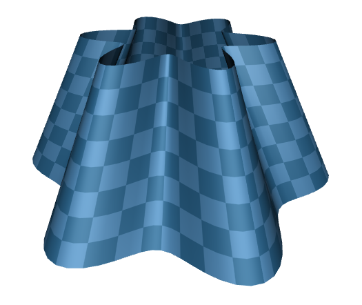
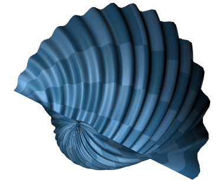

> *Note:* this repo is not expected to be updated until at least summer 2014. There is also some new technology that I would like to use to make this project nicer and some parts of SceneKit that I have a much greater understanding of now that I would like to update. 

DRMeshGeometry v0.3
==============

DRMeshGeometryBuilder is a builder of static mesh geometry that makes it really easy to do 3D graphs in SceneKit.

The above geometry was generated with this code (available in the sampe project)

    DRCartesianMeshGeometryBuilder *builder = [[DRCartesianMeshGeometryBuilder alloc] init];
    builder.textureRepeatCounts = DRMeshCountMake(10, 10);
    builder.xRange = DRMeshRangeMake(-20.0, 20.0);
    builder.zRange = DRMeshRangeMake(-20.0, 20.0);
    
    SCNGeometry *sine = [builder geometryWithCartesianFunction:^CGFloat(CGFloat x, CGFloat z) {
        return 2.0 * (sinf(.4*x) - cosf(.4*z));
    }];

Once the geometry is generated it can be shaded using any light and material just like normal geometry in the scene.

##  Other coordinate systems

There is also similar builders to construct both **cylindrical** and **spherical** meshes, as seen below.

The following code generates the *cylindrical* mesh seen below

    DRCylinderMeshGeometryBuilder *cylinderBuilder = [[DRCylinderMeshGeometryBuilder alloc] init];
    cylinderBuilder.thetaRange = DRMeshRangeMake(0, 2.0*M_PI);
    cylinderBuilder.yRange = DRMeshRangeMake(-10.0, 10.0);
    cylinderBuilder.textureRepeatCounts = DRMeshCountMake(25, 4);
    
    SCNGeometry *sine = [cylinderBuilder geometryWithCylinderFunction:^CGFloat(CGFloat theta, CGFloat y) {
        return 3.0*cosf(6.0*theta)+15.-0.5*y;
    }];

In the same manner, this code generates the *spherical* mesh seen below

    DRSphereMeshGeometryBuilder *sphereBuilder = [[DRSphereMeshGeometryBuilder alloc] init];
    sphereBuilder.thetaRange = DRMeshRangeMake(0, M_PI);
    sphereBuilder.psiRange   = DRMeshRangeMake(-M_PI_2, 1.25*M_PI);
    sphereBuilder.textureRepeatCounts = DRMeshCountMake(6, 6);
    
    SCNGeometry *sine = [sphereBuilder geometryWithSphereFunction:^CGFloat(CGFloat theta, CGFloat psi) {
        return -5.0*psi + 0.5*sinf(theta*30.0);
    }];
 
 
 
  
# Known limitations

 * Currently only supports continous geometry. 

If you need this or another addition or find a bug, please [file an issue](https://github.com/d-ronnqvist/DRMeshGeometry/issues).

# Future ideas

I’m also thinking of making the graph view into a component with properties for showing the axis and allowing the user to pan around.

-----------------

# New in v0.3

 * Two finger trackpad gestures to pan, zoom and rotate.

# New in v0.2

 * Spherical and cylindrical mesh builders.
